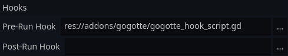
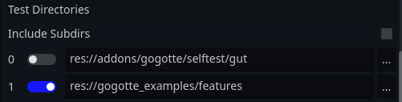

# gogotte
gogotte is a Gherkin framework for Gut (Godot Unit Test).

It allows you to create executable specifications for [Behaviour-Driven Development](https://cucumber.io/docs/bdd/) and run them using Gut.

## Dependencies
gogotte requires Python and the gherkin-official package.

```
pip install gherkin-official
```

It also requires Gut and Godot 4.x.

## Quick Start Guide
If you are unfamiliar with Gherkin, please read the [Gherkin reference](https://cucumber.io/docs/gherkin/reference/) and [step definition guide](https://cucumber.io/docs/gherkin/step-organization/) before continuing.

### Folder Structure
Here is a suggested folder structure for use with gogotte.
```
project_root/
├── .gogotteConfig               # The gogotte config file
└── test/
    ├── testdata/                # Contains test data such as scenes
    │   ├── enemy01.tscn
    │   └── ...
    ├── steps/                   # Contains your steps
    │   ├── collision_steps.gd   # You can have any number of step files
    │   ├── graphics_steps.gd    # as long as steps are globally unambiguous
    │   └── ...
    └── features/                # Contains your features
        ├── xxx_feature.feature
        └── ...
```
### Configuring Gogotte
A JSON file named `./.gogotteConfig` is placed in the project root to configure Gogotte. Here is an example corresponding to the above folder structure:
```json
{
    "step_dirs": [
        "res://test/steps/"
    ],
    "save_ast": false
}
```
'step_dirs' tells gogotte where to find your steps. It is mandatory.

'save_ast' saves a Gherkin abstract syntax tree and is only useful for developers.

### Running Gogotte
When using Gut from the Godot Editor, point the "Pre-Run Hook" field to `res://addons/gogotte/gogotte_hook.gd` as shown below.



Put your feature directories under the Test Directories heading as shown below.



Finally click Run All.

gogotte will place files with the extension `.out.gd` inside of your feature directories, which Gut will execute. It may be a good idea to put `*.out.gd` in your gitignore.

### Step Definition
See `./gogotte_examples/steps/example_steps.gd.`

Each step class should have a Dictionary `steps`, which maps step patterns to Callables.
```gdscript
var steps: Dictionary = {
    "x is equal to {}":
    func (t: GogotteTest, number: String) -> void:
        t.ctx['x'] = int(number),

    "we add {} to x":
    func (t: GogotteTest, number: String) -> void:
        t.ctx['x'] = t.ctx['x'] + int(number),

    "variable {} should be {}":
    func (t: GogotteTest, name: String, number: String) -> void:
        t.assert_eq(t.ctx[name], int(number), "x was not correct")
        t.p("OK"),
        # Don't forget the comma on the final line!
}
```
A pattern may contain placeholders marked with `{}`, which allow arguments to be passed in. The placeholder may also contain a name e.g. `{number}`, but a limitation of gogotte is that the **placeholder name doesn't map it to an argument, only its order in the pattern does**. So it is recommended to leave placeholders anonymous, as above.

gogotte does not currently distinguish between Given/When/Then/And steps.

### Scenario Context
As shown above, a step may use `t.ctx` as the context scratchpad for the scenario. `t.datatable` contains the current step's datatable if present (null otherwise), ditto for `t.docstring` and the docstring.

Example of docstring usage:
```Gherkin
Scenario: Adding items from a wishlist
    When I import my wishlist with the following items:
        """
        [
            {"name": "Apple", "quantity": 3},
            {"name": "Banana", "quantity": 2},
            {"name": "Orange", "quantity": 1}
        ]
        """
```
```gdscript
"I import my wishlist with the following items:":
func (t: GogotteTest) -> void:
    # Parse the JSON from the docstring
    var json: Array = JSON.parse_string(t.docstring)
    t.assert_not_null(json, "JSON should be valid")
```

### Built-in Tags
gogotte supports the tag `@skip` for Features and Scenarios, which skips compilation of the scenario.

## Known Limitations
- Due to a Gdscript Callable limitation, placeholder names do not matter. Their order in the pattern determines which step argument they map to.
- gut.p() output may not appear when there is a runtime error (same as plain Gut). Use print() statements in your step definitions if you need debugging.

## Why should I choose BDD?
I won't try to gas BDD too much. Other people are better at it.

Games are full of *features*. I think beginner and intermediate devs are better at specifying what a feature should do than writing tests for it. Doing so with a formal language like Gherkin provides one of the strongest forms of documentation. Nevertheless, you might still want to test it.

Godot Unit Test lets you write in-engine integration tests, but there's an impedance mismatch between specification and testing, and the two can go out of sync quite easily.

With a BDD framework like gogotte, the specification *becomes* the test. You write these specification-tests in a domain-specific language called Gherkin. Functions (called 'steps') are named and called in plain English but implemented in gdscript, making it easy for even non-technical personnel to tell what behaviour is being exercised. It also harder to desynchronize the test from its specification.

BDD is powerful not only for team projects but for solo devs who test extensively.

## Developing Gogotte
After cloning this repository, use AssetLib to add Gut to the project.

Python and gherkin-official are also needed.

Add `res://addons/gogotte/selftest/gut` as a directory in the Gut GUI in order to run the self tests.
